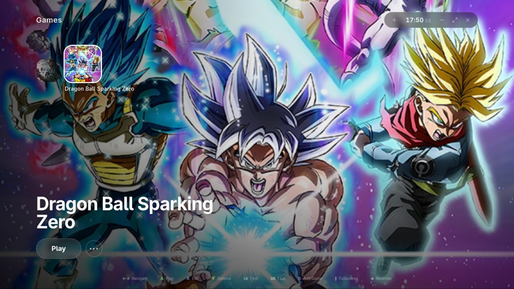

<div align="center">

# 🌌 Aurora Launcher

A console-grade game launcher for Linux.  
Launch Windows games via Proton with full gamepad support and a UI that actually feels good.

[](LICENSE)
[](#)
[](#)
[](#)
[](#)

<br/>



</div>

<br/>

---

## 🛠 Stack

| Layer | Technology |
|---|---|
| UI Framework | [Nuxt 4](https://nuxt.com) · [Nuxt UI](https://ui.nuxt.com) · [Tailwind CSS v4](https://tailwindcss.com) |
| Desktop Shell | [Electron 35](https://www.electronjs.org) |
| Language | [TypeScript 5](https://www.typescriptlang.org) |
| State / Reactivity | [Vue 3 Composition API](https://vuejs.org) · [VueUse](https://vueuse.org) |
| Validation | [Zod](https://zod.dev) |
| Game Runtime | [umu-launcher](https://github.com/Open-Wine-Components/umu-launcher) |
| Cover Art | [SteamGridDB API](https://www.steamgriddb.com) via [aurora-sgdb-proxy](https://github.com/codebyallan/aurora-sgdb-proxy) |
| Build | [tsup](https://tsup.egoist.dev) · [electron-builder](https://www.electron.build) |

---

## 📋 Prerequisites

- **Node.js** ≥ 20 and **pnpm** ≥ 9
- [`umu-launcher`](https://github.com/Open-Wine-Components/umu-launcher) available as `umu-run` in your `PATH`

```bash
# Arch Linux
yay -S umu-launcher

# Fedora
sudo dnf copr enable boreeas/umu-launcher && sudo dnf install umu-launcher

# pip (universal)
pip install umu-launcher
```

---

## ⚙️ Environment

Copy `.env.example` to `.env`:

```bash
cp .env.example .env
```

```env
# URL of the aurora-sgdb-proxy instance (Vercel Edge Function).
# Required for automatic cover art fetching — without it the launcher
# still works but hero images and icons won't be auto-fetched from SteamGridDB.
#
# In production this is injected as a GitHub Actions secret at build time.
# For local dev, run aurora-sgdb-proxy locally and point to it:
AURORA_SGDB_PROXY=http://localhost:3000/api/sgdb
```

> **Cover art setup:** the launcher never talks to SteamGridDB directly — all requests go through [aurora-sgdb-proxy](https://github.com/codebyallan/aurora-sgdb-proxy), a serverless edge function that keeps your API key server-side. For local dev, clone that repo, add your `STEAMGRIDDB_API_KEY` to its `.env`, run it, then set `AURORA_SGDB_PROXY` above.

---

## 🚀 Development

```bash
pnpm install
pnpm electron:dev
```

This runs `nuxt generate` → compiles the Electron main/preload via `tsup` → launches the window.  
DevTools open automatically in dev mode.

---

## 📦 Production Build

```bash
pnpm electron:build
```

Outputs a `.AppImage` (x64) inside `release/`.  
To target a different format, edit the `linux.target` array in `package.json`.

```bash
# Type-check before building
pnpm typecheck

# Lint
pnpm lint:fix
```

---

## 🎮 Managing Games

### Adding a game

Click **+ Add Game** in the header or press `Start` on your controller.

| Field | Description |
|---|---|
| **Game Name** | Display name shown in the carousel |
| **Executable** | Absolute path to the `.exe`, `.bat` or `.sh` |
| **Hero Image** | Banner shown in the background — auto-fetched from SteamGridDB if left empty |
| **Icon** | Square icon shown in the carousel — auto-fetched from SteamGridDB if left empty |
| **Wine Prefix** | Your `WINEPREFIX` — one per game is recommended |
| **Proton Path** | Full path to a Proton build, or leave as `GE-Proton` to let umu-run resolve automatically |
| **Game ID** | `umu-default` or a SteamDB AppID (e.g. `umu-1091500`) for better compatibility |
| **Store** | `none` · `steam` · `gog` · `egs` · `ubisoft` · `battlenet` · `ea` |
| **Arguments** | `KEY=VALUE` tokens become env vars · everything else becomes positional args passed to `umu-run` |

> **Tip:** Click **Lookup** next to the game name to auto-fill Game ID and Store from the UMU database.

#### Arguments field

The Arguments field accepts a mix of environment variables and positional args in a single string:

```
MANGOHUD=1 DXVK_HUD=fps,frametimes -dx11 -fullscreen
```

Tokens matching `KEY=VALUE` (where the key starts with a letter or `_`) are injected as env vars into the game process. Everything else is passed as positional args to `umu-run`. Tokens with spaces can be quoted:

```
PROTON_LOG=1 "My Custom Arg"
```

### Editing a game

Navigate to the game → click `···` → **Edit**, or press `X` on your controller.

### Deleting a game

`···` → **Delete**, then confirm. Your files on disk are never touched — only the library entry is removed.

### Stopping a game

Press **Stop** while a game is running, or hit `A` / `B` on your controller.  
Aurora walks the full process tree with `SIGKILL` — no orphaned Wine or Proton instances are left behind.

---

## 🕹 Controller Support

Aurora auto-detects **Xbox**, **PlayStation** and **generic** controllers and adjusts button labels accordingly.

| Input | Action |
|---|---|
| `←` `→` D-Pad or Left Stick | Navigate carousel |
| `A` | Play · Stop |
| `X` | Edit game |
| `Y` | Options menu |
| `LB` `RB` | Jump to first · last game |
| `Start` | Add game |
| `Select` | Toggle fullscreen |
| `Home` | Minimize |

The cursor hides automatically after **800 ms** of controller input and reappears on mouse movement.

---

### Key design decisions

- **Zero Node.js in the renderer** — all filesystem and process access goes through a strongly-typed `contextBridge` IPC bridge defined in `preload.ts`.
- **Atomic library writes** — `library.json` is written via `tmp → rename` to prevent corruption on crash.
- **Persist-first pattern** — IPC calls happen before in-memory state updates; UI and disk never diverge.
- **Custom protocols** — the SPA is served via `app://` and cover images via `cover://`, both mapped to the local filesystem. No `file://` security issues.
- **Gamepad as a singleton** — `useGamepad` is module-level so all components share one polling loop and one `Map` of button states.
- **API key never in the binary** — cover art requests go through [aurora-sgdb-proxy](https://github.com/codebyallan/aurora-sgdb-proxy), a Vercel edge function that injects the `Authorization` header server-side. The launcher only knows the proxy URL, injected at build time via `AURORA_SGDB_PROXY`.

---

## 📁 User Data

All persistent data lives under `~/.config/aurora-launcher/`:

| Path | Contents |
|---|---|
| `library.json` | Game library — array of `CarouselItem` objects |
| `covers/` | Downloaded and copied cover art images |

---

## 📄 License

[GNU General Public License v3.0](LICENSE)

This program is free software: you can redistribute it and/or modify it under the terms of the GNU General Public License as published by the Free Software Foundation, either version 3 of the License, or (at your option) any later version.